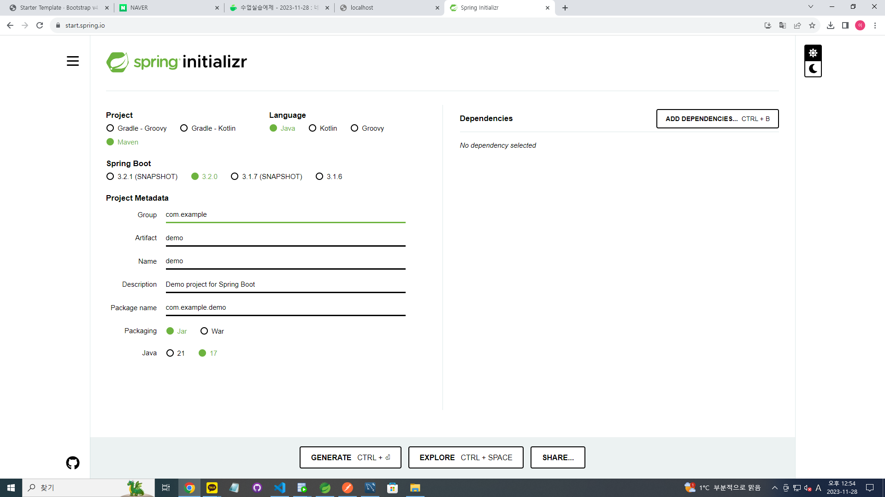
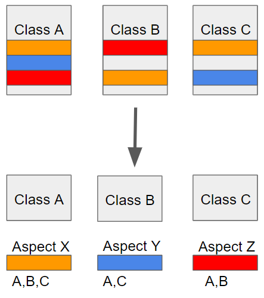

aㅁHandlebar : 자바스크립트 템플릿 엔진 -> 서버에서 보내온 JSON 형태의 데이터를 사용하여 작업할 때 편하게 작업 가능.
핸들바 공식사이트
https://handlebarsjs.com/

str += `<button type="button" class="btn btn-info" data-rew_num="${rew_num}">Info</button>`; 
"${rew_num}" EL문법으로 먼저 해석되어 값이 들어가지 않는다. jsp연결문자열로 변경해준다. 백틱`` -> 작은따옴표'' + 
'<button type="button" class="btn btn-info" data-rew_num="' + rew_num + '">Info</button>'; 변경 후

정적
동적(프로그램 상 추가)

웹 요청방식 
    - get:select문, 
    - post:insert,update,delete문 / 
    수정 시 - put/petch:update, 
            - delete:delete
REST API 개발방법론. 
    - CRUD(Create Read Update Delete)

cf) spring legacy project -> spring mvc project - view : jsp 기본제공 -> 설정파일 : servlet-context.xml, root-context.xml
    sprintg starter project -> spring boot project - view : thymeleaf 기본권장. jsp권장 X. 설정작업을 통해 사용가능 
                                                        : 설정파일 :  jsp기본권장
bean 설정 : Java Class 파일로 Bean 작업.
application.properties

pom.xml 기본 내장 파일이름 sprign boot starter ~
DemomallApplication : 프로젝트명__Application : 메인파일 

<docmall 최종정리>
spring MVC project : pom.xml, web.xml 버전을 동일하게 한다. 

web.xml 내 DispatcherServlet객체 : Front Controller역할 (모든 controller를 주도한다) , 매핑주소를 담당하는 제어로 넘겨줌. (중요!!!!!!!!)
https://velog.io/@betterfuture4/Spring-Dispatcher-Servlet-%EC%A0%95%EB%A6%AC
https://zzang9ha.tistory.com/441

email-config.xml, root-context, servlet-context.xml

패키지구조 = mapper.xml 폴더구조

CATEGORY_TBL(카테고리 테이블)    
    - CG_CODE컬럼 : 1차, 2차, 3차 모든 카테고리 코드가 저장.
    - CG_PARENT_CODE컬럼(NULL 허용) : CG_CODE컬럼에 삽입된 코드의 부모카테고리 코드가 저장.(데이터베이스 데이터에 특수문자 에러나면 & 사용하기)
    - CG_NAME컬럼 : 카테고리 이름
---> CategoryVO 생성

VO, DTO 등등의 클래스는 Controller, Service, Mapper 패키지의 클래스 또는 인터페이스에서 사용이 되기 때문에 먼저 생성을 해두어야 작업이 편해짐.

ADMIN_TBL(관리자 카테고리 관리) - 등록, 수정, 삭제 작업. - 사용유무컬럼. Y, N

상품테이블 : primary key컬럼을 설정 시 제약조건이름을 수동으로 생성해야 한다.
            이유? primary key제약조건이름이 인덱스명으로 생성이 되어, 인덱스를 페이징쿼리의 오라클 인덱스힌트 명령어로 사용해야 하기 때문.

ctrl + 객체 : open declaration 추상메소드
GlobalContollerAdvice 내에 firstCategoryList를 pro_insert, 
HomeController의 "/"루트주소를 index.jsp

CKEditor 설정
adProductController
server.xml

jsp로 데이터를 뿌릴 때만 model 사용, ajax로 호출 시 사용 X

jstl c:~
    pro_list : <%@ taglib uri="http://java.sun.com/jsp/jstl/core" prefix="c"%>
    pom.xml :
            <dependency>
                        <groupId>javax.servlet</groupId>
                        <artifactId>jstl</artifactId>
                        <version>1.2</version>
                    </dependency>

상품이미지</a>

<form id="actionForm> // actionForm 사용
    <input type="hidden" name="pageNum" value="29">
</form>

jsp에서 정보(Model)을 이용하여 출력 시 
    1)메소드의 파라미터가 가지고 있는 값을 jsp에서 사용 시 : @ModelAttribute("cri");
    2)메소드에 의하여 진행되는 jsp에서 정보를 호출할 때 Model객체 사용

테이블 간의 참조(Foreign key) 작업 시 확인사항
    - Foreign key 생성 X or 제거
    - Foreign key 생성을 하면서 조건을 단다.

    - 부모테이블(1)과 자식테이블(N) 참조키 설정이 되어(데이터) 있으면, 기본으로 부모테이블은 삭제에러발생
        참조키가 설정되어 있는 상태에서 부모테이블 삭제 시 null 설정

제약조건 잠시 비활성화 https://deftkang.tistory.com/145

<spring boot>
https://start.spring.io - 이 사이트에서 라이브러리 받아옴.  -   
src 내 jsp 기본지원 X  
new - spring starter project - 
    packaging(배포파일 제작) : jar외장톰캣서버 등록 작업 X(스프링부트 프로젝트 내 내장톰캣 존재, jsp실행) / 
        war(톰캣서버 내 스프링 프로젝트)

최신 버전 : spring regacy project 지원 X

application.properties파일 :
src - main - 내 파일 수동생성 (WEB-INF - views) views 내 3,4 8,9(계정, 비번), 15 (mybatis 위치 설정)
server port = 3000
file.dir = C:\\dev\\upload\\product\\

controller 파일 : 
{file}

email.properties 파일을 email.config 에서 @Configuration으로 참조

db작업까지 완료되었을 떄 실행 1)초록색 전원모양 클릭 - (re)start 2) run as - spring boot app

Jar : 내장톰캣O(자바환경에 배포 가능)
War : 톰캣이 있는 서버에 배포 가능

spring_workspace sts4 복사해 새로운 workspace 만들어 실행

help - about spring tool suite 4에서 버전 확인
STS4 - JDK 1.8 변경작업하기

초반 세팅) window - preferences - java - (사진 참고)

2) help - install new software / eclipse marketplace
eclipse marketplace에서 web install하면 preferences에서 web설정 나타난다.

new - spring starter project - 링크 복사해 접속 https://start.spring.io 여기서 만들어 import해 사용 가능

maven, java, 3.2.0, group 프로젝트이름, artifact, package name, jar, 17
만들고 같은 워크스페이스에 넣어 import

maven, gradle = 빌드 관리 소프트웨어 

프로젝트 우클릭 - run as - spring boot app으로 실행

초록색 전원 - 

스프링부트 bin 설정 - 자바 파일 만들어서 한다. 

spring root_context.xml / 스프링부트 application.properties - 비밀번호, 설정

비밀번호 암호화 작업 : 스프링 spring-security , web.xml에서 spring-security / 스프링부트 securityConfig.java

port 충돌 시 주소 변경 application.properties 내 server.port=9000

@component 어노테이션
https://programmingrecoding.tistory.com/13

<git> STS tool 형태 작업
팀장(PL)과 팀원(개발자)의 협업
    - 팀장 (doccomsa) MVC
        원격 repository(기본 브랜치 main) : 필수 README.md 파일 생성하기(동기화 이해) 생성 후 깃허브에 협업 프로젝트 공유 -> 로컬 레포지토리 커시
        개발컴퓨터에 플젝 생성 -> 로컬 레포지토리(기본 브랜치 master) 생성 -> 소스 올리기.
        1) Git Repositories
            spring100[master] : 로컬 레포지토리
                - Remotes
                    -origin
            로컬 레포지토리와 원격레포지토리 동기화(Sync)
            로컬에서 원격으로 push 작업을 하기 위해서는 원격의 내용을 로컬에 동일하게 가지고 있어야 한다.
            원격에서 pull(fetch + merge) 작업으로 로컬로 가져와 동기화를 해야 한다.
            origin - configure fetch - branch

            -> push작업
                Pull Request -> Merge 작업
                
                    main branch(default) + master내용이 머지merge
                    master

    - 팀원 spring boot
    팀장의 원격레포지토리를 공유 : Fork작업
    팀장의 원격레포지토리 생성.

new branch (ex : dev01)에 기본작업 후 작업 이어나감.
문제없으면 main branch에 merge

원격 레포지토리 내 (세 개의 공간 존재, 순서대로 업로드 가능)
소스작업(working directory) -add-> 스테이징 영역 -commit-> local repository -push-> 업로드

git repositories - orgin - 초록색 구름 우클릭 - configure fetch - source에서 스페이스바(branch나타남. 클릭) - next - finish - save and fetch
master(branch이름) 우클릭 - 

import - git - project from git(MVC)
             - project from git and 어쩌공(boot)

<리눅스>
aws 가입, 해외결제 가능 카드준비. 

spring.ppk 키페어

서버 원격접속 프로그램 
  - putty 다운

관리자(root)계정 비밀번호 변경및 로그온
$  sudo passwd root
$  1234
$  1234

$ su root
$ 1234

exit 사용

ubuntu 계정으로 복귀

cd /
mkdir download

sudo apt-get update : apt-get에서 관리하는 저장소의 s/w 목록정보를 받아오는 갱신작업.
sudo apt-get upgrade : 현재 우분투에 설치된 s/w를 업데이트
sudo apt-get install unzip
apt, apt-get 차이점
https://amkorousagi-money.tistory.com/entry/linux-apt-apt-get-%EC%B0%A8%EC%9D%B4-%EC%82%AC%EC%9A%A9%EB%B2%95-%EC%84%A4%EB%AA%85-%ED%8C%A8%ED%82%A4%EC%A7%80-%EC%9E%90%EB%8F%99-%EC%84%A4%EC%B9%98-%EC%8A%A4%ED%81%AC%EB%A6%BD%ED%8A%B8-%EC%9E%91%EC%84%B1-%EC%8B%9C-%EB%8D%94-%EC%A2%8B%EC%9D%80-%EA%B2%83

winscd 프로그램으로 이동하고, ubuntu 사용자도 수정 권한주기
cd /
chmod 777 download

날짜 설정 UTC -> KTS한국표준시간으로 변경하는 명령어
date
ln -sf /usr/share/zoneinfo/Asia/Seoul /etc/localtime
date

오라클 11g xe
https://www.oracle.com/database/technologies/xe-prior-release-downloads.html

오라클 설치과정
https://yunamom.tistory.com/335 ( 기준 )
https://blog.naver.com/codingspecialist/221326952278 : root 비번변경 작업 참고

zip파일 압축해제 : https://changhoi.kim/posts/linux/zip-command/
unzip 파일명.zip

cd download

unzip 파일명.zip

sudo apt-get -y install alien libaio1 unixodbc : alien libaio1 unixodbc 소프트웨어3개 다운(-y 모든 사항에 yes)

cd Disk1
ls
alien --scripts -d oracle*    // .rmp ->.deb 파일변환
    -d oracle-xe

-- 오라클 설치
dpkg --install oracle*.deb
dpkg로 패키지 설치, 검색, 제거
: https://skylit.tistory.com/60#google_vignette

cd ~  // ubuntu 사용자의 홈디렉토리로 이동

/etc/init.d/oracle-xe configure

/var/lib/dpkg/info/oracle-xe.postinst: line 114: /sbin/chkconfig: No such file or directory
You must run '/etc/init.d/oracle-xe configure' as the root user to configure the database.

오라클 환경변수
/u01/app/oracle/product/11.2.0/xe/bin

ubuntu:~$ sudo vi ~/.bashrc

#아래 설정을 넣어준다.
export ORACLE_HOME=/u01/app/oracle/product/11.2.0/xe 
export ORACLE_SID=XE 
export NLS_LANG=`$ORACLE_HOME/bin/nls_lang.sh` 
export ORACLE_BASE=/u01/app/oracle
export LD_LIBRARY_PATH=$ORACLE_HOME/lib:$LD_LIBRARY_PATH 
export PATH=$ORACLE_HOME/bin:$PATH
:w(저장)q(나가기)

복사해서 vi에서 마우스 우클릭하면 붙이기 됨.

ubuntu:~$ source ~/.bashrc

source ~/.bashrc 환경설정 갱신됨.

오라클 접속확인
sqlplus
system
비밀번호1234

CREATE USER spring IDENTIFIED BY spring; 우클릭하면 붙여넣기된다.
conn spring/spring;

리스너 상태확인
lsnrctl status

FTP 접속 프로그램
 - 파일질라 클라이언트(private key사용)

43.201.66.16

ubuntu

- 우분투에 jdk 1.8 설치및 환경변수 설정 : https://chucoding.tistory.com/54
sudo apt-get install openjdk-8-jdk

없는지 확인체크
$ apt search openjdk

$ sudo add-apt-repository ppa:openjdk-r/ppa
$ sudo apt-get update
$ sudo apt-get install openjdk-8-jdk

자바위치 확인
$ which java
$ readlink -f /usr/bin/java

~$ sudo vi /etc/profile

환경변수 정보
export JAVA_HOME=/usr/lib/jvm/java-8-openjdk-amd64/jre
export PATH=$JAVA_HOME/bin:$PATH
export CLASS_PATH=$JAVA_HOME/lib:$CLASS_PATH

$ source /etc/profile

권한명령
chmod 777 download

sudo mkdir www
sudo chmod 777 www

pom.xml 가장 하단에 추가
        <!-- maven build 시 데이터베이스 연결 제외 -->
			<plugin>
			    <groupId>org.apache.maven.plugins</groupId>
			    <artifactId>maven-surefire-plugin</artifactId>
			    <configuration>
			        <skipTests>true</skipTests>
			    </configuration>
			</plugin>
            
프로젝트 우클릭 - run as - Maven build... -  worksapce(프로젝트), goals, profiles 제거, run

인바운드 : 외부에서 들어오는 포트 / 아웃바운드 : 나감
aws 인바운드 규칙 편집 
/ 인스턴스 종료 (정보 삭제) - 꼭!
/ 인스턴스 중지나 재부팅 -> 오라클 서비스 중지 ->  
원격터미널 : Putty
sqlplus /nolog
SQL> conn sys/ as sysdba
SQL> startup (오라클 재시작?)

sudo apt-get install openjdk-8-jdk 
which java (심볼릭, 바탕화면 바로가기 너낌) -결과-> $ readlink -f /usr/bin/java

$ readlink -f /usr/bin/java --> jdk 가 설치된 경로확인 (like 바탕화면 바로가기에서 파일위치 열기)dk tnlakfuqek tnlsmstlrks,,

usr/lib/jvm/java-8-openjdk-amd64/jre/bin/java

usr/lib/jvm/java-8-openjdk-amd64/jre... (bin 폴더 기준)

sudo vi /etc/profile (파일) -> 명령모드 돌입..

export JAVA_HOME=/usr/lib/jvm/java-8-openjdk-amd64/jre
export PATH=$JAVA_HOME/bin:$PATH
export CLASS_PATH=$JAVA_HOME/lib:$CLASS_PATH

esc

source /etc/profile

스프링부트 배포파일 *.jar
java -jar ezen.jar

세션이 끊어지면 톰캣 구동 종료
백그라운드 jar파일을 구동. 세션과 상관없이 스프링부트 플젝을 실행상태로 만든다.
nohup java -jar ezen.jar &
exit

java -version
javac -version

aws 인스턴스:9000 dksl tnlakfudnjdy

putty configuration 

